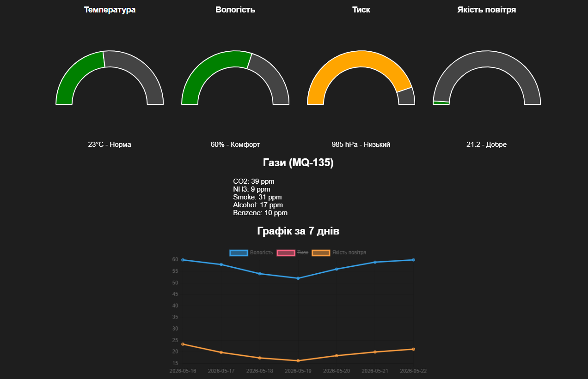
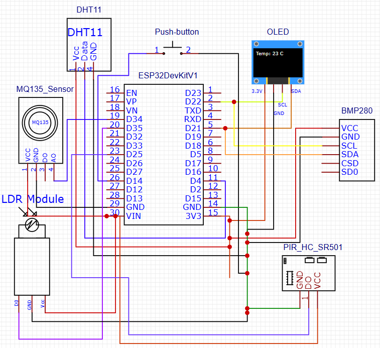
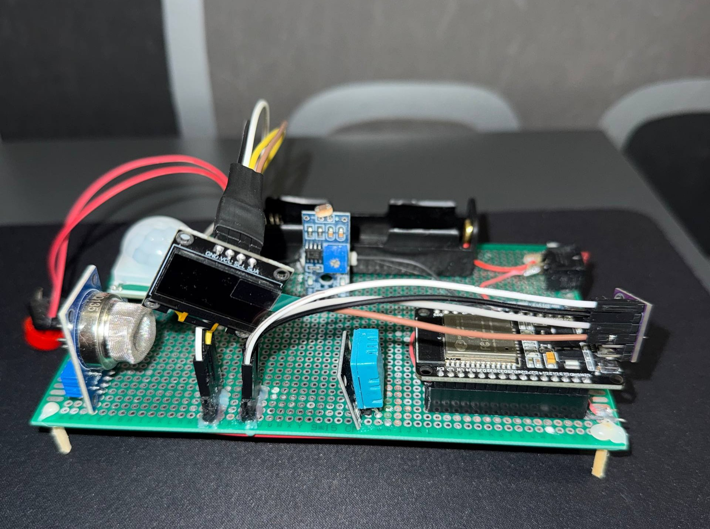
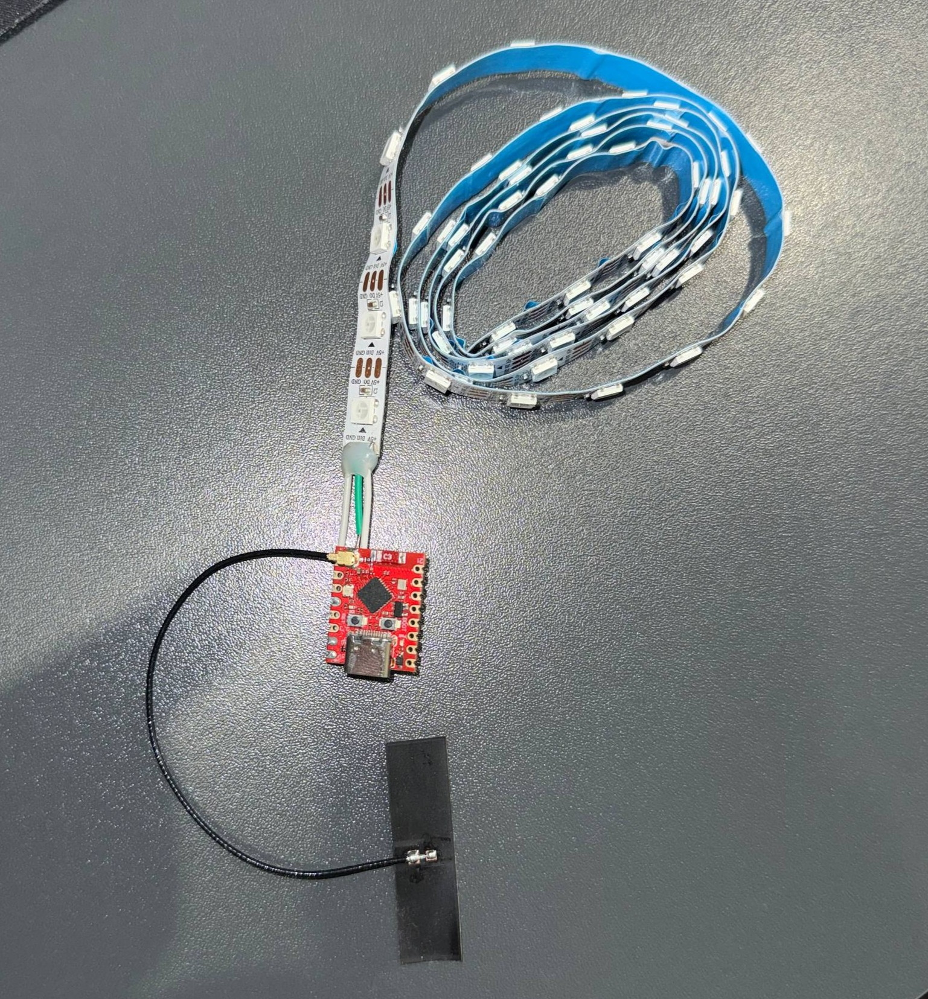
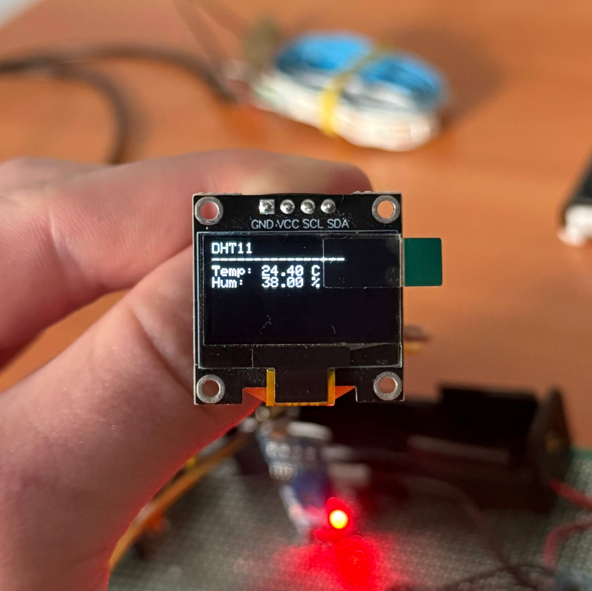

# 📘 Система моніторингу та керування освітленістю та температурою "розумного дому" на базі контролера ESP32

> *Розподілена програмно-апаратна IoT-система для екологічного моніторингу, автоматизації освітлення та аварійного оповіщення.*

---

## 👤 Автор

- **ПІБ**: Степюк Андрій Андрійович
- **Група**: ФЕС-41
- **Керівник**: Баран Микола, асистент, асистент кафедри радіофізики та комп'ютерних технологій.
- **Дата виконання**: 24.05.2026

---

## 📌 Загальна інформація

- **Тип проєкту**: IoT система (Апаратна частина + вебсайт)
- **Мова програмування**: C++ (мікроконтролери), Python (бекенд), JavaScript / HTML / CSS (фронтенд), SQL.
- **Фреймворки / Бібліотеки**: Arduino, Flask, MySQL, Chart.js, Telegram Bot API, FastLED, Adafruit GFX/SSD1306.

---

## 🧠 Опис функціоналу

- 🌡️ **Екологічний моніторинг**: Збір телеметрії.
- 💡 **Автоматизація освітлення**: Бездротове, автоматичне увімкнення LED-стрічки.
- 💾 **Збереження даних**: Накопичення історії про клімат.
- 🚨 **Аварійні сповіщення**: Миттєві сповіщення у Telegram при загрозі пожежі або забрудненні повітря.
- 📊 **Веб-аналітика**: Інтерактивна веб-панель  з динамічними графіками.
- 🔋 **Енергозбереження**: Апаратна оптимізація споживання ESP32.

---

## 🧱 Опис основних класів / файлів

| Клас / Файл                 | Призначення |
|-----------------------------|-------------|
| `Smart_Home.ino`            | Прошивка головного інформаційного модуля ESP32 |
| `Smart_Home_LED.ino`        | Прошивка виконавчого модуля ESP32-C3 SuperMini |
| `app.py`                    | Точка входу серверної частини (бекенд, робота з MySQL та Telegram) |
| `index.html` / `script.js`  | Клієнтська веб-панель із графіками  |
| `init_db.sql`               | SQL-скрипт для розгортання таблиць `sensor_data` в базі даних `smart_home` |

---

## ▶️ Як запустити проєкт "з нуля"

#### **1. Встановлення інструментів** ####
- Arduino IDE 2.3.8
- XAMPP 8.2.12
- Python 3.11.9

#### **2. Клонування репозиторію** ####
``` 
git clone https://github.com/AndriiStepiuk/Smart_Home.git
cd Smart_Home
```
#### **3. Встановлення бібліотек** ####
- В Arduino IDE у бічному меню відкрити розділ LIBRARY MANAGER та вставновити настуспні бібліотеки:
```
Adafruit_GFX
Adafruit_SSD1306
Adafruit_BMP280
DHT.h
FastLED
```
- У редакторі коду (наприклад VS Code) відкрити термінал та ввести наступні команди:
```
pip install flask
pip install requests
```
#### **4. Завантаження прошивок** ####

#### Прошивка для ESP32-С3 ####

 1. Відкрити файл `Smart_Home_LED_BLE.ino` в Arduino IDE 
 2. В полях ssid та password ввести дані відповідно до вашої мережі Wi-Fi 
 3. Вибрати плату `ESP32C3 Dev Module` 
 4. Завантажити прошивку, нажавши кнопку `Upload` 
 5. Після успішного завантаження, необхідно відкрити `Serial Monitor` та скопіювати IP-адресу, яку видасть ESP32-C3 
 
#### Прошивка для ESP32 ####

##### 1. Відкрити файл `Smart_Home.in`o в Arduino IDE ##### 
##### 2. Аналогічно заповнити дані про мережу ##### 
##### 3. Вставити попередньо скопійовану IP-адресу в поле `ledServer` ##### 
##### 4. Вставити IP-адресу вашого ПК у рядок: #####
    serverURL = "http://ВАШЕ_ІР/data"; (як дізнатись ІР, описано нижче)
##### 5. Вибрати плату `ESP32 Dev Module` ##### 
##### 6. Завантажити прошивку, нажавши кнопку `Upload` ##### 
##### 7. Після успішного завантаження, в Serial Monitor побачемо вдале підключення до мережі ##### 


#### Як дізнатись ІР-адресу власного ПК ####
##### 1. Відкрийте командний рядок #####
##### 2. Введіть команду #####
    ipconfig
##### 3. Знайдіть рядок `IPv4 Address` та скопіюйте адресу #####

#### **5. Створення Telegram Bota** ####

##### 1. У застосунку Telegram створіть бота за допомогою #####
    @BotFather
##### 2. Після успішного створення бот надішле `TOKEN` вашого створеного бота (для безпеки не публікуйте нігде цей TOKEN) #####
##### 3. Надішліть стовреному боту будь-яке повідомлення #####
##### 4. Відкрийте у браузері посилання з вашим токеном #####
    https://api.telegram.org/botВАШ_ТОКЕН/getUpdates  
##### 5. У вкладці що відкриється знайдіть рядок `"chat":{"id":123456789` та скопіювати числа після двокрапки #####

#### **6. Розгортання серверної частини** ####

##### 1. Відкрийте програму XAMPP та запустіть модулі  Apache i MySQL нажавши кнопки `Start`
##### 2. У файлі app.py знайдіть рядок `CHAT_ID` і вствте туди попередньо скопійоване id, також у поле `BOT_TOKEN` ваш токен
##### 3. Для запуску у цьому ж файлі введіть команду 
    python app.py 

## 🔌Перегляд передачі даних ##
**POST /data**

Приймає телеметрію від головного контролера ESP32 та записує її в базу даних.

**Request:**

```json
{
  "temperature": 23.5,
  "humidity": 45.2,
  "pressure": 1012.3,
  "co2": 415.8,
  "nh3": 14.2,
  "smoke": 32.1,
  "light": 1540
}
```

## 🖱️ Інструкція для користувача 

Система функціонує автономно, надаючи користувачу три незалежні інтерфейси для моніторингу та взаємодії з \"розумним домом\".

### 1. 🎛️ Апаратний інтерфейс 
На самому пристрої розташовано OLED-дисплей та фізичну кнопку керування. 

 Кнопка перемикання гортає інформаційні панелі на екрані:
  - `Екран 1 (Клімат)` — відображає поточну температуру °C, вологість %.
  - `Екран 1 (Барометр)` - відображає атмосферний тиск hPa.
  - `Екран 2 (Якість повітря)` — показує рівень забрудненості повітря: CO2, аміак (NH3) та дим у ppm.
  - `Екран 3 (Освітленість)` — виводить рівень світла у відсотках.

### 2. 💻 Веб-панель аналітики 
Глобальний моніторинг здійснюється через веб-браузер:
- **Головна сторінка** — містить інтерактивні лінійні графіки для кожного з показників мікроклімату.
- **Автооновлення** — користувачу не потрібно оновлювати сторінку вручну. Дані на графіках плавно перемальовуються кожні 5 секунд завдяки фоновим запитам до сервера.
- **Ретроспектива** — наведення курсору на точку графіка показує точне значення та час фіксації метрики.

### 3. 📱 Telegram-сповіщення (Система безпеки)
Бот працює у фоновому режимі як пожежна сигналізація. Користувач миттєво отримує повідомлення у критичних ситуаціях:
- `🚨 УВАГА! Високий рівень диму!` — тригериться при задимленості > 50 ppm.
- `🔥 Можлива пожежа! Висока температура!` — спрацьовує при нагріванні кімнати > 30°C.
- `⚠️ Високий рівень CO2!` — попереджає про задуху (> 1000 ppm), якщо потрібно провітрити приміщення.
- `💦 Низька вологість!` — нагадування увімкнути зволожувач повітря (вологість < 30%).

### 4. 💡 Фонова автоматизація 
Не потребує жодного ручного керування:
- Якщо система фіксує сутінки (рівень світла < 35%) ТА датчик виявляє рух людини — система миттєво вмикає адресну LED-стрічку. 
- Після того, як людина покидає кімнату, світло автоматично гасне після завершення таймера затримки.

## 📷 Приклади / скриншоти ##

**Веб-панель**



**Схема підключення**



**Вигляд головного модуля** 



**Вигляд виконавчого модуля**



**Робота дисплея**




## 🧪 Проблеми і рішення

| Проблема | Рішення |
|----------|----------|
| Arduino IDE не бачить COM-порт | Перевірити USB Data-кабель та встановити драйвери CH340 або CP210x |
| Помилка `Failed to connect to ESP32` під час прошивки | Під час напису `Connecting...` затиснути кнопку BOOT на ESP32 на 2–3 секунди |
| ESP32 не підключається до Wi-Fi | Перевірити правильність SSID та пароля, переконатися у використанні мережі 2.4 GHz |
| Дані не надходять на Flask-сервер | Перевірити IP-адресу сервера, налаштування Firewall та параметр `host='0.0.0.0'` |
| Помилка підключення до MySQL | Переконатися, що MySQL запущений у XAMPP та база даних створена |
| Telegram Bot не повертає CHAT_ID | Надіслати боту команду `/start` або будь-яке повідомлення та повторно виконати `getUpdates` |
| Telegram Bot не надсилає сповіщення | Перевірити правильність `BOT_TOKEN`, `CHAT_ID` та наявність доступу до Інтернету |
| Дані не відображаються в Dashboard | Перевірити HTTP запити|
| Serial Monitor порожній | Перевірити правильний COM-порт та швидкість 115200 baud |
| Неправильні значення датчиків | Перевірити калібрування датчиків, підключення та живлення ESP32 |


## 🧾 Використані джерела / література ##

- ESP32 документація
- ESP32С3 документація
- Arduino IDE документація
- Telegram Bot API документація
- Flask документація
- XAMPP документація
